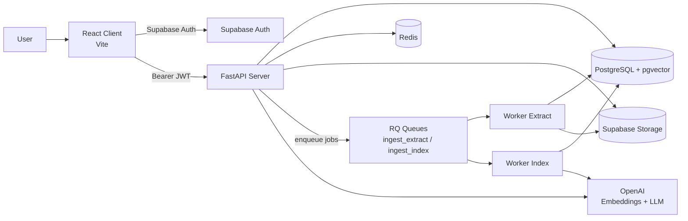

# Enterprise RAG System (v1)

Production-oriented monorepo for a workspace-scoped Retrieval-Augmented Generation (RAG) platform using Supabase Auth, FastAPI, Redis/RQ workers, PostgreSQL + pgvector, and a React client.

This repository follows `AGENTS.md` as the locked architecture contract. Some modules are scaffolded with TODOs; this README distinguishes current implementation from planned flow.

## Project Overview

Enterprise RAG enables a user to:
- authenticate with Supabase
- create a single workspace (v1 constraint)
- upload and index PDFs (pipeline scaffolded)
- run grounded queries over selected documents (query pipeline scaffolded)
- enforce a strict daily token budget per workspace

## Architecture Diagram



ASCII view:

```text
Client (React) -> FastAPI -> Postgres(pgvector)
      |              |            ^
      v              v            |
 Supabase Auth    Redis/RQ -> Worker(s)
      |                           |
      +---------------------------+
                 Supabase Storage / OpenAI
```

## Tech Stack

- Backend: FastAPI, SQLAlchemy, Pydantic Settings
- Database: PostgreSQL + pgvector
- Queue: Redis + RQ
- Auth/Storage: Supabase Auth + Storage
- AI: OpenAI (`text-embedding-3-small`, `gpt-4o-mini` per locked architecture)
- Frontend: React + TypeScript + Vite + Supabase JS
- Infra/Dev: Docker Compose, Nginx (production client image)

## High-Level Flow

### 1) Supabase Auth
- Client signs in via Supabase (`client/src/lib/supabase.ts`).
- Client gets `access_token` from session.
- Backend validates bearer token in `server/app/core/auth.py` using Supabase SDK (with REST fallback).

### 2) Workspace Creation
- `POST /workspaces` creates one workspace per user.
- Enforced uniqueness: if existing workspace owned by user is found, returns `409`.
- A daily usage row (`workspace_daily_usage`) is initialized at creation.

### 3) Token Budget Engine
- Budget tracked per workspace/day in `workspace_daily_usage`.
- Implemented operations:
  - reserve (`reserve_tokens`)
  - release (`release_tokens`)
  - commit actual usage (`commit_usage`)
  - read status (`get_budget_status`)
- `GET /usage/today` returns `{used,reserved,limit,remaining,resets_at}`.

### 4) Document Ingestion
- Locked architecture defines `upload-prepare -> upload-complete -> extract -> chunk -> embed -> ready`.
- Current repo status:
  - document/query endpoints are scaffolded placeholders
  - worker jobs `ingest_extract` and `ingest_index` are TODO stubs
  - DB schema and queue wiring are present

### 5) RAG Query Flow
- Locked architecture requires strict grounded retrieval over workspace-scoped chunks.
- Current repo status:
  - `/query` route exists but returns `Not implemented`
  - retrieval/chunking/embeddings modules are scaffolded

## Environment Variables

Core env is defined in `.env.example`.

```bash
# Supabase
SUPABASE_URL=
SUPABASE_SERVICE_ROLE_KEY=
SUPABASE_ANON_KEY=
SUPABASE_JWT_SECRET=
SUPABASE_KEY=  # compatibility alias

# AI
OPENAI_API_KEY=

# Data/queue
DATABASE_URL=
REDIS_URL=

# App
ENVIRONMENT=development
API_HOST=0.0.0.0
API_PORT=8000
DAILY_TOKEN_LIMIT=100000

# Client
VITE_API_URL=http://localhost:8000
VITE_SUPABASE_URL=
VITE_SUPABASE_ANON_KEY=
```

What matters most right now:
- `SUPABASE_URL` + service role key for backend token validation
- `VITE_SUPABASE_URL` + anon key for client auth
- `DATABASE_URL` for server + workers
- `REDIS_URL` for workers

## Run Locally (Backend + Frontend)

### Option A: Docker Compose (recommended)

```bash
cp .env.example .env
docker-compose up --build
```

Services:
- API: `http://localhost:8000`
- Client: `http://localhost:5173`
- RQ Dashboard: `http://localhost:9181`

### Option B: Run modules directly

Server:

```bash
cd server
python -m venv .venv && source .venv/bin/activate
pip install -r requirements.txt
uvicorn app.main:app --reload --host 0.0.0.0 --port 8000
```

Client:

```bash
cd client
npm install
npm run dev -- --host 0.0.0.0
```

Worker (example queue):

```bash
cd worker
python -m venv .venv && source .venv/bin/activate
pip install -r requirements.txt
QUEUE_NAME=ingest_extract REDIS_URL=redis://localhost:6379/0 python worker.py
```

## Run With Supabase

1. Create Supabase project.
2. Fill `.env` with Supabase URL, service role key, anon key.
3. Apply schema:

```bash
psql "$DATABASE_URL" -f scripts/schema.supabase.sql
```

4. Start stack (`docker-compose up --build`).
5. Open client and sign in.

Basic API check with JWT:

```bash
curl -H "Authorization: Bearer <SUPABASE_ACCESS_TOKEN>" \
  http://localhost:8000/auth/me
```

Create workspace:

```bash
curl -X POST http://localhost:8000/workspaces \
  -H "Authorization: Bearer <SUPABASE_ACCESS_TOKEN>" \
  -H "Content-Type: application/json" \
  -d '{"name":"My Workspace"}'
```

Get usage today:

```bash
curl -H "Authorization: Bearer <SUPABASE_ACCESS_TOKEN>" \
  http://localhost:8000/usage/today
```

## Folder Structure Summary

```text
enterprise-rag/
├── server/           # FastAPI API + token budget + DB models
├── client/           # React/Vite frontend with Supabase auth
├── worker/           # RQ workers (extract/index + maintenance)
├── scripts/          # DB schema/bootstrap scripts
├── infrastructure/   # Terraform/K8s placeholders
├── docker-compose.yml
└── AGENTS.md         # Locked architecture contract
```

## Development Order Roadmap

1. Complete document API contracts (`upload-prepare`, `upload-complete`, list/status).
2. Implement extraction worker (`worker/jobs/ingest_extract.py`) and page persistence.
3. Implement chunking + embeddings pipeline (`server/app/core/chunking.py`, `embeddings.py`, `worker/jobs/ingest_index.py`).
4. Implement retrieval + grounded query endpoint (`server/app/api/query.py`, `core/retrieval.py`).
5. Add stale reservation scheduled maintenance integration and observability.
6. Expand client from test harness to full app pages (`Documents`, `Query`, `Usage`, `Dashboard`).
7. Harden with integration tests (auth, workspace isolation, ingestion, retrieval, budget edge cases).
